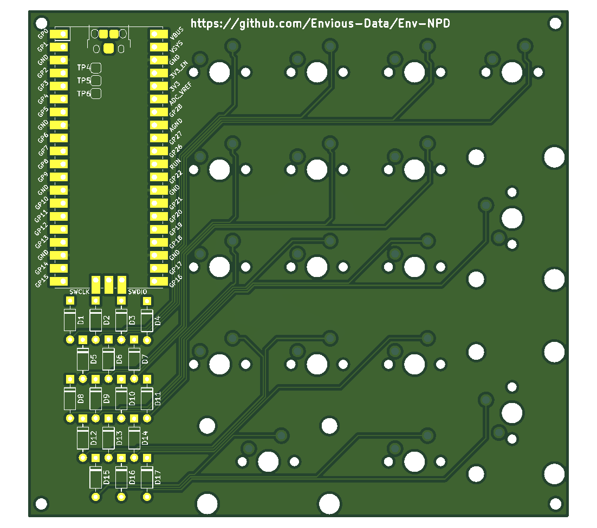

# Env-NPD
A Raspberry Pi Pico powered Numpad!

### What is this?
This is another RPI Pico type mechanical board thing alike my other project but a entirely seperate numpad!

This will use KMK and CircuitPython and should be incredibly easy to build.

### Parts List
* 1x Raspberry Pi Pico
* 17x Keyboard Switches of your choosing
* 17x 1N4148 Diodes (through hole)
* Numpad Keycap set
* Numpad PCB

